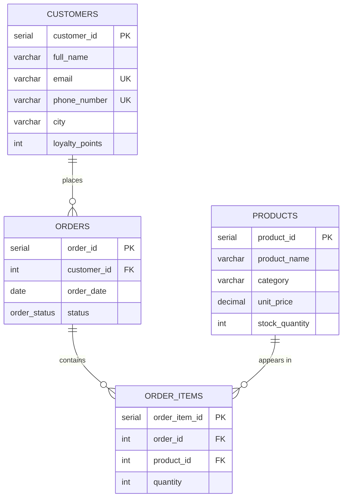

# Sunrise Supermarket — Relational Database Design in PostgreSQL


A relational database for a fictional Kenyan supermarket, designed and built from an empty PostgreSQL instance — schema design, constraint-enforced data integrity, schema migrations, and 14 business queries spanning filtering, aggregation, and four-table joins.

---

## The problem

A supermarket needs to answer questions its point-of-sale exports can't: *who are our repeat customers, which products actually move, and which orders are stuck?* Answering those requires a normalised schema where a single order can hold many products, and where the database itself — not the application — guarantees that stock never goes negative and orders never reference customers who don't exist.

## What this project demonstrates

| Area | Evidence in the code |
|---|---|
| **Schema design** | 3NF design with a junction table resolving the many-to-many between orders and products |
| **Data integrity** | `PRIMARY KEY`, `FOREIGN KEY`, `UNIQUE`, `NOT NULL`, `CHECK`, `DEFAULT` — prices, stock, and quantities cannot go negative |
| **Type safety** | Custom `ENUM` for order status instead of an unvalidated `varchar` |
| **Schema evolution** | `ALTER TABLE` migrations that keep existing rows valid (`DEFAULT 0` on a new `NOT NULL` column) |
| **Referential integrity** | Child rows checked before a parent `DELETE`, so FK violations are reasoned about rather than hit |
| **Querying** | Filtering, wildcards, sorting, `GROUP BY` / `HAVING`, `INNER` vs `LEFT JOIN`, four-table joins |

---

## Schema

Four tables. `order_items` is the junction table that lets one order contain many products, and one product appear in many orders.



<details>
<summary>Column reference</summary>

**customers** — `customer_id` PK · `full_name` · `email` (unique) · `phone_number` (unique) · `city` · `loyalty_points` (≥ 0, default 0)

**products** — `product_id` PK · `product_name` · `category` · `unit_price` (≥ 0) · `stock_quantity` (≥ 0, default 0)

**orders** — `order_id` PK · `customer_id` FK → customers · `order_date` (defaults to today) · `status` ENUM: pending / delivered / cancelled

**order_items** — `order_item_id` PK · `order_id` FK → orders · `product_id` FK → products · `quantity` (> 0)

</details>

---

## Repository structure

```
.
├── 01_schema.sql    Schema, ENUM, tables, constraints, ALTER migrations
├── 02_data.sql      Seed data, plus UPDATE and DELETE operations
├── 03_queries.sql   14 business queries, grouped by SQL concept
│
└── archive/         Original working files, kept for history
    ├── mwai_victor_sunrise_supermarket.sql
    └── sunrise.sql
```

The three numbered scripts are the canonical version of this project — they are dependent, so run them in order.

`archive/` holds the original single-file scratchpad the project was written in, before it was split by concern. It is kept to show how the work actually developed; it is not meant to be run.

---

## Getting started

**Requires** PostgreSQL 14+ (built on 16).

```bash
git clone https://github.com/Mwaivictor/sunrise_supermarket_sql.git
cd sunrise_supermarket_sql

createdb sunrise_supermarket

psql -d sunrise_supermarket -f 01_schema.sql
psql -d sunrise_supermarket -f 02_data.sql
psql -d sunrise_supermarket -f 03_queries.sql
```

Everything lives in a `sunrise` schema, so it won't collide with an existing `public` schema. To explore interactively:

```sql
SET search_path TO sunrise;
\dt
```

---

## Business questions answered

Each query in [`03_queries.sql`](03_queries.sql) maps to a question the business would actually ask.

**Filtering & search**
1. Which products cost more than KES 100?
2. Which customers are based outside Nairobi?
3. Which products fall in the KES 60–200 price band?
4. Which customers live in our three priority cities?
5. Which products have "Oil" in the name?
6. Which orders are still awaiting fulfilment?

**Ranking**

7. What are the two most expensive products?

**Aggregation**

8. How many orders has each customer placed?
9. Which customers are repeat buyers?

**Joins**

10. Which customer placed each order?
11. Which orders have no line items attached? *(LEFT JOIN — the empty ones are the point)*
12. Which products were purchased in each order?
13. Full order detail across all four tables.
14. What is the total quantity sold per product?

---

## Design decisions worth calling out

**A junction table, not a product column on `orders`.** Putting `product_id` directly on `orders` would cap an order at one product. `order_items` carries the quantity, which belongs to the order-product pair rather than to either side alone.

**`ENUM` over `varchar` for order status.** The database rejects `'delivrd'` at write time instead of letting a typo become a silently missing row in every status report.

**`CHECK` constraints instead of application validation.** `unit_price >= 0`, `stock >= 0`, and `quantity > 0` hold no matter which client writes the data — a rule enforced in one application is a rule that a second application breaks.

**The new `loyalty_points` column defaults to 0.** Adding a `NOT NULL` column to a populated table fails unless existing rows have a value; the `DEFAULT` makes the migration safe.

**Child rows checked before deleting a parent.** Order 4 was verified to have no `order_items` before being deleted. Had it, PostgreSQL would have raised a foreign key violation and the line items would have to be removed first.

---

## Roadmap

- [ ] Indexes on FK columns and frequently filtered fields
- [ ] Views for recurring reports (sales per product, customer order history)
- [ ] Triggers to decrement `stock_quantity` when an order is placed
- [ ] Transactions wrapping multi-step order processing
- [ ] Window functions for running totals and product rankings
- [ ] Extend the schema with suppliers, employees, and payments

---

## Tech stack

PostgreSQL 16 · pgAdmin · VS Code

## Author

**Mwai Victor Brian** — [GitHub](https://github.com/Mwaivictor)

Licensed under the MIT License. If this was useful, a ⭐ is appreciated.
