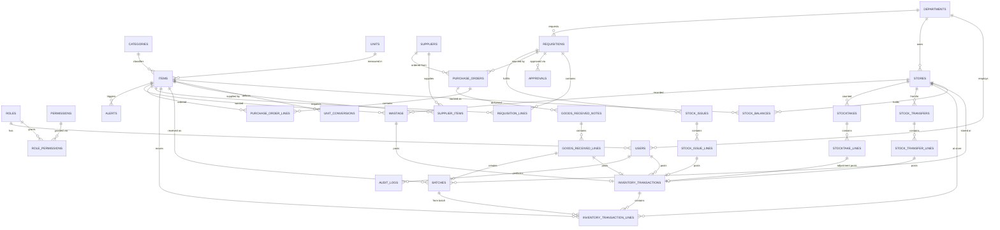

# Entity-Relationship Diagram

Full DDL lives in [`../db/schema.sql`](../db/schema.sql). This is the conceptual map.

## Design notes

- **Every stock-affecting document (GRN line, issue line, transfer line, stocktake
  variance, wastage) posts exactly one `inventory_transactions` row through the backend's
  `inventory_engine` service.** No table other than that ledger is ever the source of
  truth for "how much is on hand" — `stock_balances` is a maintained cache reconciled
  against it (section 51 of the source brief).
- `inventory_transactions` is header + `inventory_transaction_lines` detail so one
  physical event (e.g. one GRN, one issue voucher) can move several items at once while
  still producing one auditable transaction number.
- Corrections never UPDATE/DELETE a posted transaction; they INSERT a `reversal` typed
  transaction referencing the original (section 14).
- `batches` carries expiry per received lot; `inventory_transaction_lines.batch_id` is
  nullable (not every item is batch-tracked) but required whenever `items.batch_tracked`
  is true — enforced in the backend, not just the UI.
